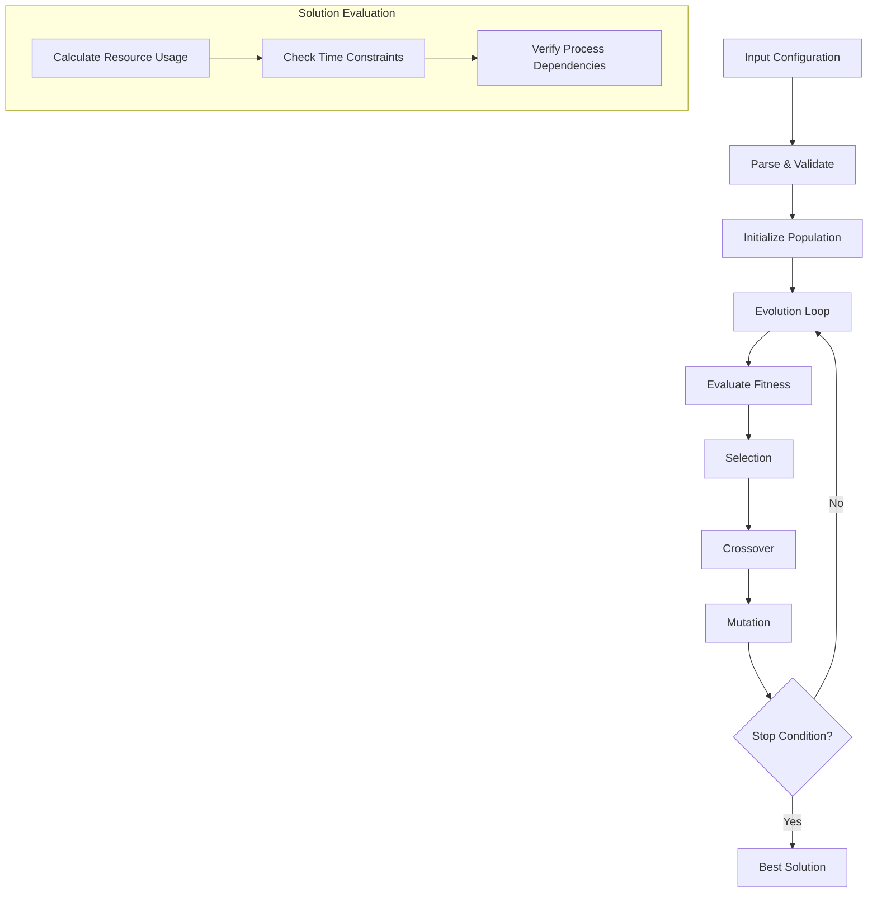

# Kinetic Resource Planning Simulator

A TypeScript implementation of a resource planning and optimization system that simulates and optimizes process chains based on resource constraints.

## Overview

The simulator takes a configuration file describing:

- Initial resource stocks
- Available processes with their inputs, outputs, and delays
- Optimization goals (time and/or specific resources)

It then produces an optimized execution plan that maximizes the specified goals while respecting resource constraints.

## Features

- Parallel process execution when resources allow
- Resource dependency tracking and optimization
- Time and resource optimization
- Comprehensive input validation
- Process chain verification
- Detailed execution logs

## Installation

Install dependencies:

```bash
npm install
```

Build the project:

```bash
npm run build
```

## Usage

### Running the Simulator

Basic usage:

```bash
npm run krpsim -- <config_file> <max_delay>
```

Example:

```bash
npm run krpsim -- resources/simple 1000
```

### Running the Verifier

Basic usage:

```bash
npm run verify -- <config_file> <trace_file>
```

Example:

```bash
npm run verify -- resources/simple output.txt
```

### Additional Scripts

Clean build artifacts and logs:

```bash
npm run clean
```

Complete rebuild (clean + reinstall + build):

```bash
npm run rebuild
```

## Configuration File Format

The configuration file uses a simple text format:

```
# Comments start with #

# Initial stocks (required)
stock_name:quantity

# Process definitions (at least one required)
process_name:(need1:qty1;need2:qty2):(result1:qty1;result2:qty2):delay

# Optimization goals (required)
optimize:(time|stock1;time|stock2;...)
```

Example:

```
# Initial stock
euro:10

# Processes
equipment_purchase:(euro:8):(equipment:1):10
product_creation:(equipment:1):(product:1):30
delivery:(product:1):(happy_client:1):20

# Optimize for time and happy clients
optimize:(time;happy_client)
```

## Input Validation

The parser performs comprehensive validation of input files:

1. Stock Validation

   - No duplicate stock names
   - No negative initial quantities
   - At least one stock must be defined

2. Process Validation

   - Unique process names
   - All required resources must exist
   - Valid process delays
   - At least one process must be defined

3. Optimization Validation
   - All optimization targets must exist
   - Valid optimization format

## Algorithm Description

The simulator uses a genetic algorithm approach to find optimal solutions:



1. **Population Initialization**

   - Creates initial set of possible solutions
   - Each solution represents a sequence of process executions
   - Initial solutions are created with consideration of resource constraints

2. **Evolution Process**

   - Solutions are evaluated based on optimization goals
   - Best solutions are selected for reproduction
   - New solutions are created through crossover and mutation
   - Process repeats until optimal solution is found or time limit reached

3. **Solution Evaluation**
   - Calculates resource usage throughout process chain
   - Verifies time constraints and process dependencies
   - Considers optimization goals (time and/or specific resources)

The implementation uses standard genetic algorithm parameters that have been proven effective for resource optimization problems:

- Population size: 100 individuals
- Smart individuals ratio: 80%
- Mutation rate: 10%

For detailed explanation of genetic algorithms and their application to resource optimization, see:
https://www.optimization101.org/genetic-algorithms-in-resource-optimization

## Test Cases

### Valid Scenarios

- `resources/simple` - Linear process chain
- `resources/ikea` - Parallel processes
- `resources/steak` - Complex dependencies

### Invalid Scenarios

- `resources/invalid/no_stocks` - Missing initial stocks
- `resources/invalid/unknown_need` - Unknown resource requirements
- `resources/invalid/unknown_optimize` - Invalid optimization target
- `resources/invalid/duplicate_process` - Duplicate process names
- `resources/invalid/duplicate_stock` - Duplicate stock names
- `resources/invalid/negative_stock` - Negative initial quantities
- `resources/invalid/no_processes` - No processes defined

## License

MIT License - see LICENSE file for details
